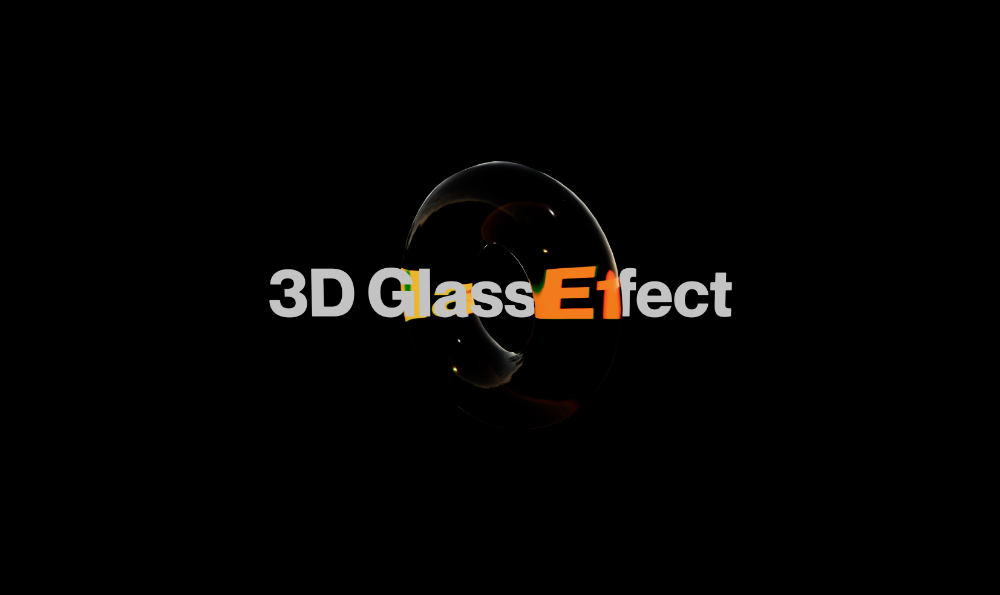

# 3D Glass Effect with Next.js and React Three Fiber

This is a [Next.js](https://nextjs.org) project bootstrapped with [`create-next-app`](https://nextjs.org/docs/app/api-reference/cli/create-next-app).
It showcases a stunning **3D Glass Effect** using **React Three Fiber** and **Valtio** for state management.


[Live Demo](https://r3f-effects-3d-glass.vercel.app/)

## Overview

The project implements a visually appealing 3D glass effect using a torus shape that simulates the properties of glass, including transparency and refraction. The effect is enhanced by dynamic color changes based on user interactions, smooth animations, and an overlay of customizable text.

### Key Features

- **Interactive 3D Model**: The torus model appears glass-like, with realistic light transmission properties.
- **Dynamic Color Changes**: The color of the torus changes when hovered over or scale when clicked, providing an interactive experience as well as changes the environement lightning.
- **Smooth Animations**: The torus rotates continuously, enhancing the 3D effect.
- **Text Overlay**: Customizable text is displayed on the torus, which can also change color based on interactions.

## Getting Started

To get started with the project, follow these steps:

1. **Clone the repository**:
   ```bash
   git clone <repository-url>
   cd r3f-effects-3d-glass
   ```

2. **Install dependencies**:
   ```bash
   npm install
   # or
   yarn install
   # or
   pnpm install
   ```

3. **Run the development server**:
   ```bash
   npm run dev
   # or
   yarn dev
   # or
   pnpm dev
   # or
   bun dev
   ```

4. **Open your browser**:
   Navigate to [http://localhost:3000](http://localhost:3000) to see the result.

You can start editing the page by modifying `app/page.tsx`. The page auto-updates as you edit the file.

## How It Works

The 3D Glass Effect is achieved through the following techniques:

- **3D Model Loading**: The torus model is loaded using the `useGLTF` hook from the `@react-three/drei` library.
  
- **Material Properties**: The `MeshTransmissionMaterial` is used to simulate glass properties, allowing for transparency and refraction.

- **State Management**: The project uses Valtio for managing the state of the application.

- **Animation**: The `useFrame` hook from `@react-three/fiber` is used to rotate the torus continuously, while the `useSpring` hook from `@react-spring/three` creates smooth transitions for color and scale changes.

- **Text Rendering**: The `Text` component from `@react-three/drei` overlays text on the torus, which can change color based on user interactions.

## Deploy on Vercel

The easiest way to deploy your Next.js app is to use the [Vercel Platform](https://vercel.com/new?utm_medium=default-template&filter=next.js&utm_source=create-next-app&utm_campaign=create-next-app-readme) from the creators of Next.js.

[](https://vercel.com/new/clone?repository-url=https%3A%2F%2Fgithub.com%2Fmihailt%2Fr3f-effects-3d-glass&project-name=r3f-effects-3d-glass&repository-name=r3f-effects-3d-glass&demo-title=3D%20Glass%20Effect%20with%20Next.js%20and%20React%20Three%20Fiber&demo-url=https%3A%2F%2Fr3f-effects-3d-glass.vercel.app%2F&demo-image=https%3A%2F%2Fraw.githubusercontent.com%2Fmihailt%2Fr3f-effects-3d-glass%2Fmain%2Freadme%2F3d_glass_effect.png)


## TLDR; Implementation Details:

The project implements a **3D Glass Effect** using **Next.js** and **React Three Fiber**. This effect is achieved through a combination of 3D modeling, material properties, and interactive animations. Here’s a breakdown of the effect and how it is achieved:

1. **Transparency and Refraction**: 
   The torus is rendered using a material that simulates glass properties, allowing light to pass through and bend. This is achieved with the `MeshTransmissionMaterial`, which provides realistic refraction and transparency.

   ```typescript
   <MeshTransmissionMaterial 
       thickness={snap.thickness} 
       roughness={snap.roughness} 
       transmission={snap.transmission}
       ior={snap.ior}
       backside={snap.backside}
   />
   ```

2. **Dynamic Scale and Color Changes**: 
   The scale and color of the torus change based on user interactions, providing a more immersive experience. When the user hovers over the torus, it transitions to an active color, and when clicked, it scales up to an active size. When the interaction ends, it returns to its default size and color. This is managed through state variables that track the hover and active states.

   ```typescript
   const [hovered, setHover] = useState(false);
   const [active, setActive] = useState(false);

   useSpring({
       color: hovered ? snap.color.active : snap.color.default,
       scale: active ? snap.scale.active : snap.scale.default,
       config: config.wobbly,
   });
   ```

    In this code snippet, the `useSpring` hook is used to create smooth transitions for both the color and scale of the torus. When the user hovers over the torus, the color changes, and when clicked, the `setActive` function toggles the active state, triggering the scale change and enhancing the interactive experience.

3. **Continuous Rotation**: 
   The torus rotates smoothly around its axis, creating a dynamic visual effect. This rotation is handled in the render loop using the `useFrame` hook, which updates the rotation values on each frame.

   ```typescript
   useFrame((state, delta) => {
       if (meshRef.current) {
           meshRef.current.rotation.x += delta * 2;
       }
   });
   ```

4. **Text Overlay**: 
   A text element is rendered on top of the torus, providing context or information. The text color can also change based on user interactions, making it visually cohesive with the torus.

   ```typescript
   <Text 
       color={textColor}
       fontSize={viewport.width / snap.viewportWidthFactor * snap.fontSize} 
       font={snap.font}
       position={[0, 0, 0]}
   >
       {snap.text}
   </Text>
   ```

5. **User Interaction**: 
   The project allows users to interact with the torus by clicking and hovering. These interactions trigger state changes that affect the appearance of the torus, such as scaling and color changes, making the experience engaging and immersive.

   ```typescript
   <mesh
       ref={meshRef}
       scale={scale}
       onClick={(event) => setActive(!active)}
       onPointerOver={(event) => setHover(true)}
       onPointerOut={(event) => setHover(false)}
   >
   ```

    In this code snippet, the `onClick`, `onPointerOver`, and `onPointerOut` event handlers are used to manage the interaction states. When the user clicks on the torus, it toggles the active state, and when the user hovers over it, it sets the hover state to true, allowing for dynamic visual feedback.